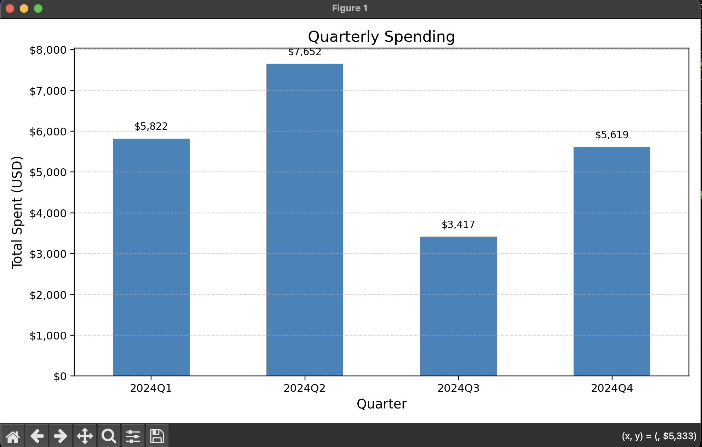
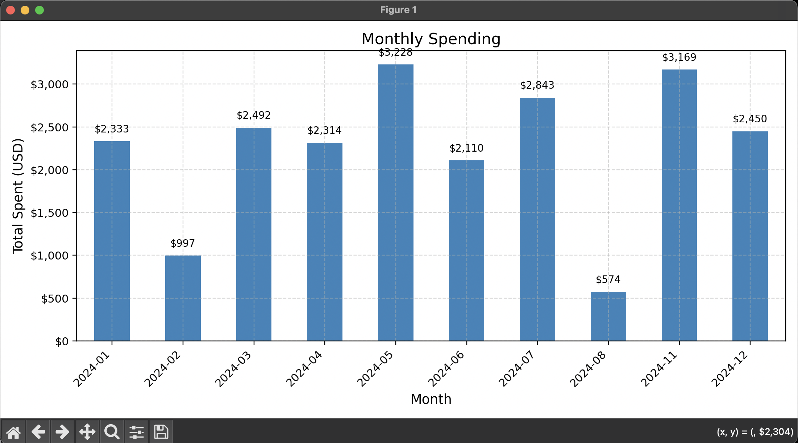
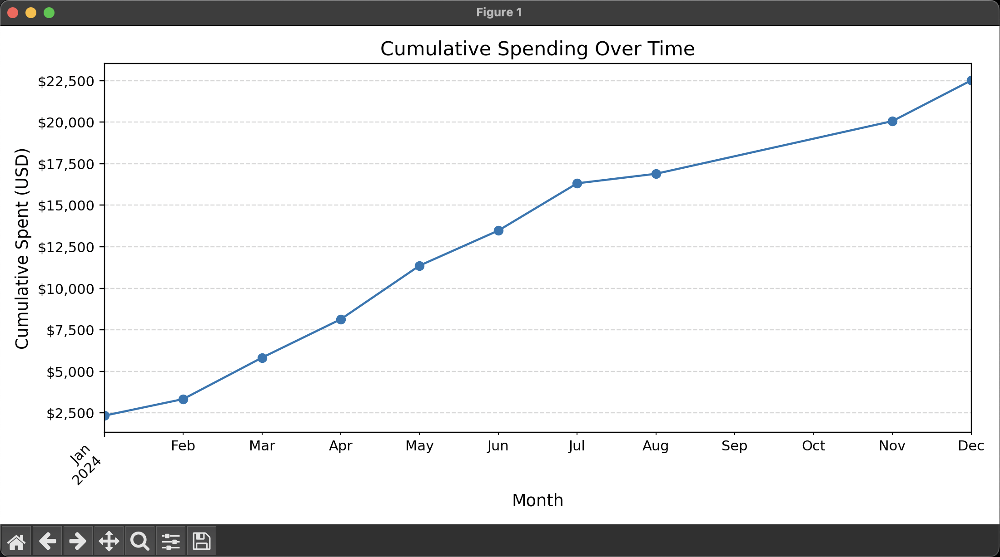

# Finance Tracker (Python · Pandas · Matplotlib)

A simple, beginner‑friendly **personal finance tracker** that reads a CSV of transactions (`Date, Amount`),
computes **monthly totals**, flags **overspending** against a user‑entered limit, and shows clean **charts**
(monthly, quarterly, cumulative).

This repository contains two scripts:

- `Financial Tracker.py` — the main script (interactive).  
- `thecallfunc.py` — chart helpers (visuals only).

> This version focuses on **visual polish** and **clear console output** while keeping the logic simple.

---

## Project Structure
```
.
├─ Financial Tracker.py     # entry point (run this file)
├─ thecallfunc.py           # visualization helpers
├─ transactions.csv         # sample data (Date, Amount)
├─ requirements.txt         # Python dependencies
└─ README.md                # you are here
```

---

## Quickstart

### 1) Create a virtual environment
**Windows (PowerShell):**
```powershell
python -m venv .venv
.venv\Scripts\Activate.ps1
```

**macOS/Linux (bash/zsh):**
```bash
python3 -m venv .venv
source .venv/bin/activate
```

### 2) Install dependencies
```bash
pip install -r requirements.txt
```

### 3) Run the tracker
```bash
# Windows PowerShell (quotes needed because the filename has a space)
python ".\Financial Tracker.py"

# macOS/Linux
python3 "Financial Tracker.py"
```

You will be prompted for:
1) **CSV filename** (e.g., `transactions.csv`)  
2) **Monthly spending limit** (any positive number)

The script will print summaries and display three charts:
- **Monthly Spending (bar chart)**
- **Quarterly Spending** (bar chart via `thecallfunc.visualize_quarterly_spending`)
- **Cumulative Spending (line chart)**

> Tip: If your CSV is elsewhere, provide the full path (e.g., `C:\Users\you\Downloads\my.csv`).

---

## CSV Input Format

- **Required columns:** `Date`, `Amount`  
- **Date format:** `YYYY-MM-DD` is safest  
- **Amount:** numeric (e.g., `1159.92`)

Example:
```csv
Date,Amount
2024-01-20,1159.92
2024-01-28,1055.60
2024-02-14,450.00
```

## Example Outputs

<p align="center">
  
  <br>
  <em>Figure 1 — Monthly Spending</em>
</p>

<p align="center">
  
  <br>
  <em>Figure 2 — Quarterly Spending</em>
</p>

<p align="center">
  
  <br>
  <em>Figure 3 — Cumulative Spending</em>
</p>
---

## Troubleshooting

- **ModuleNotFoundError: pandas / matplotlib**  
  Run `pip install -r requirements.txt` (inside your virtual environment).

- **FileNotFoundError for CSV**  
  Make sure the CSV is in the same folder, or type the full path when prompted.

- **Charts don’t appear**  
  Some IDEs suppress plots. Try running from a system terminal (PowerShell on Windows or Terminal on macOS).

- **Filename with spaces**  
  Use quotes around the script path, e.g., `python "Financial Tracker.py"`.

---

## Roadmap (optional ideas)
- Add a non‑interactive CLI (e.g., `--csv` and `--limit` flags with `argparse`).
- Save plots to an `assets/` folder for README screenshots.
- Add unit tests for monthly and quarterly totals.

---

## License
MIT — feel free to use and modify.
